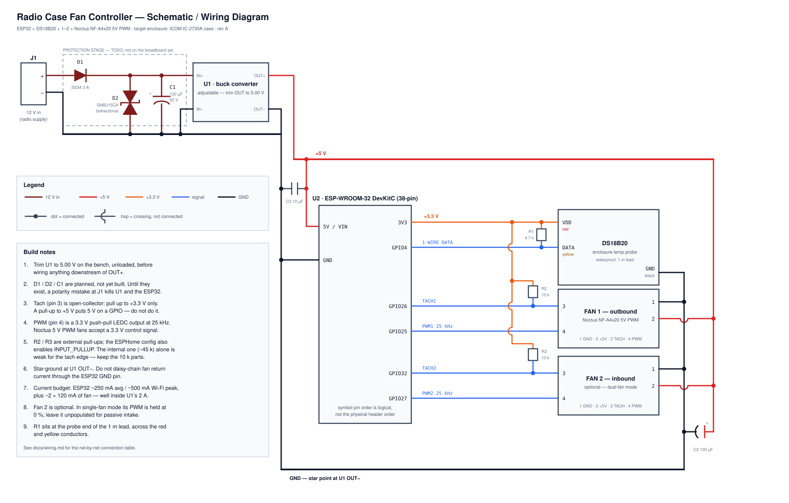

# Radio Case Fan Controller

ESP32 + ESPHome temperature-controlled fan module for cooling enclosed radio
equipment cases (initial target: the ICOM IC-2730A compact organizer, reusable
for other go-box modules). Supports one Noctua 5V PWM fan (outbound only,
passive intake) or two (matched outbound + inbound), switchable in software.

## Status

**Working prototype, in production use.** Built on a protoboard carrier and
running in the radio case: temperature-driven fan control, dual-fan operation
and RPM monitoring are all verified on hardware.

Next is a custom PCB to replace the protoboard, then the enclosure. Breadboard
was development-lab only and is behind us.

## Hardware on hand

- ESP32-C6-WROOM-1 dev board (RISC-V, 2×15 headers, dual USB-C)
- HiLetgo DS18B20 waterproof temperature probe (1-Wire, stainless steel, 1m)
- Noctua NF-A4x20 5V PWM fan(s)
- 12V → 5V buck converter with a **USB-C output** (any module ≥1A)

## Schematic

[`hardware/schematic.svg`](hardware/schematic.svg) — full electrical diagram.
[`docs/wiring.md`](docs/wiring.md) has the net-by-net connection table, the
connector pinouts, the BOM, and the order to bring the board up in.

[](hardware/schematic.svg)

## Pinout (ESP32-C6-WROOM-1 dev board)

| Signal                | GPIO   | Side   | Notes                                            |
| --------------------- | ------ | ------ | ------------------------------------------------ |
| DS18B20 data (1-Wire) | GPIO6  | Left   | 4.7kΩ pull-up to 3.3V between data and VCC       |
| Fan 1 (outbound) PWM  | GPIO18 | Right  | Hardware LEDC output, 25kHz per Noctua PWM spec  |
| Fan 1 tach            | GPIO19 | Right  | Open-collector; 10kΩ pull-up to **3.3V**, not 5V |
| Fan 2 (inbound) PWM   | GPIO20 | Right  | Hardware LEDC output, 25kHz                      |
| Fan 2 tach            | GPIO21 | Right  | Open-collector; 10kΩ pull-up to **3.3V**, not 5V |

Pins chosen to avoid the C6 strapping pins (4, 5, 8, 9, 15 — 8 also drives the
onboard RGB LED, 9 is the BOOT button, 15 has no internal pull), the USB
Serial/JTAG pair (12, 13), and the UART0 pins wired to the USB bridge (16, 17).
GPIO14 is not broken out, and GPIO24–30 are consumed by the SPI flash bus.

The four fan signals sit as a contiguous block on the right header while the
1-Wire probe is on the left, putting it on the physically opposite side of the
board from the 25kHz PWM edges. Spare after this: GPIO0, 1, 2, 3, 7, 10, 11,
22, 23.

## Power wiring

- Radio supply (12V nominal, wide tolerance) → buck converter input, direct.
  No protection components by design — the box is fed from a battery or bench
  supply, which handle surge and reverse polarity at the source
- The buck's only output is **USB-C**, so 5V reaches the board through a USB-C
  cable into one of the dev board's two ports
- Both fans take 5V and GND from the dev board's header pins — so **fan power
  depends on the dev board**. See the power topology section of
  [`docs/wiring.md`](docs/wiring.md) for what that implies
- **One power source at a time**: the buck and both USB-C ports share a net.
  Don't leave the buck connected while a computer is plugged in
- No bulk or decoupling caps on the 5V rail; 4-pin PWM fans don't chop their
  supply current, and the dev board has its own input decoupling

## Fan PWM/tach notes

- Noctua 4-pin fans expect ~25kHz on the PWM control line; the ESP32-C6's
  hardware `LEDC` peripheral hits this natively at ~11-bit resolution (this is
  why an ESP32-class part over an ESP8266 — ESP8266's software PWM can't
  cleanly reach 25kHz and tends to produce audible whine)
- Tach line is open-collector: it only pulls low, never drives high, so a
  simple pull-up to 3.3V is safe — no level shifting needed
- Fans report 2 tach pulses per revolution; the ESPHome config's
  `pulse_counter` filter accounts for this
- **No PWM signal means full speed**, not stopped — the fan pulls its control
  input high internally. Expect a spin-up if you unplug a PWM line while the
  fan is powered
- Each fan draws 0.1A / 0.5W at full speed (Noctua spec)

## Software

`icom2370a-fan-controller.yaml` — ESPHome config. Key behavior:

- DS18B20 reading drives a linear PWM ramp between a configurable min/max
  temperature (exposed as tunable `number` entities, not hardcoded)
- "Dual Fan Mode" switch: on = both fans run the same curve; off = only
  Fan 1 (outbound) runs, Fan 2 output held at 0% for passive-intake mode
- Fallback WiFi AP + local API so the module stays controllable if the
  field WiFi network isn't up
- Local web UI at `http://<device-ip>/` for the sensors, fan-curve numbers and
  Dual Fan Mode switch, with its assets embedded in flash so it works with no
  internet. Needs `web_server_username` / `web_server_password` in `secrets.yaml`

### First flash

1. Copy `secrets.yaml.example` to `secrets.yaml` and fill in your values
2. Flash. The boot log lists the 1-Wire devices found on GPIO6; confirm the
   probe enumerates. No address needs configuring — see the note in the YAML
3. Confirm fan curve thresholds via Home Assistant or the ESPHome web UI
   before buttoning up the enclosure

## Repo layout

```
/esphome/icom2370a-fan-controller.yaml    # ESPHome config
/esphome/secrets.yaml.example
/hardware/schematic.svg                    # schematic / wiring diagram
/hardware/esp32-photo.jpg                  # dev board + protoboard carrier, for the header map
/docs/wiring.md                            # net list, connection table, BOM, bring-up order
README.md
.gitignore
```

Still to come under `/hardware/`: the custom PCB, then the OpenSCAD enclosure.

## Problem solving

Lessons from first bring-up on real hardware. [`docs/wiring.md`](docs/wiring.md)
carries the electrical detail.

### Start with the `[D][fan]` log line

It prints every 5s and shows the live setpoints alongside the computed duty:

```
[D][fan:197]: t=32.88 lo=25.0 hi=45.0 floor=0.30 -> duty=0.674 dual=1
```

The three setpoints are `restore_value: true`, so whatever you last set from the
web UI or Home Assistant **outranks `initial_value` in the YAML** and survives
both reboots and OTA updates. Trust this line, not the config file.

### Symptom table

| Symptom | Likely cause |
| ------- | ------------ |
| Fan runs constantly, RPM flat `0.00`, no response to duty changes | PWM and tach swapped at the fan connector. Verify by **wire colour** — blue is PWM, green is tach — because pin numbering is exactly what's unreliable when this happens |
| Fan runs at full speed | No PWM signal reaching it. An open control line is held high by the fan's internal pull-up, which reads as 100% duty |
| Fan seems to idle quietly | It may in fact be at 100%. An NF-A4x20 is only ~18 dB(A) flat out, so full speed and idling sound alike without a reference |
| Fan turns at 0% duty | Something is wrong upstream — this fan **does** stop at 0%, verified on the bench |
| RPM reads `0.00` while the fan spins | Tach pull-up on the wrong rail, or the tach line open. A spinning fan's tach reads ~1.6V on a DC meter; a flat rail voltage means no pulses |
| RPM reads absurdly high (~234,000) | The `multiply` filter is wrong. `pulse_counter` reports pulses/min, so RPM = pulses/min ÷ 2 |

### Techniques worth remembering

**Raw versus published values.** `[D][pulse_counter]` prints the raw
`pulses/min`, untouched by filters. Comparing it against the published RPM
separates a sensor problem from a scaling problem.

**Measure at both ends of a wire.** Continuity from a GPIO to a header pin says
nothing about whether the fan's own conductor is landed there. Assuming it did
cost several rounds of diagnosis.

**Slow RPM feedback?** The pulse counters run at `update_interval: 60s`. Drop
them to `10s` temporarily while chasing a tach problem, then put them back.

**Changing setpoints without Home Assistant.** The device serves a local page at
`http://<device-ip>/` with the fan-curve numbers and the Dual Fan Mode switch.
Assets are embedded in flash, so it works with no internet.

**Reference figures.** At ~67% duty expect roughly 3,900 RPM (Fan 1) and
4,050 RPM (Fan 2) — useful for judging whether a reading is plausible.

## TODO

- [ ] Design a custom PCB for the carrier board, using the protoboard build as
      the reference
- [ ] Design enclosure (OpenSCAD) once the PCB is finalized
- [ ] Consider stall detection (tach == 0 while PWM > 0) as a fault alert
