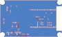

# Carrier PCB — rev A

KiCad 8 project for the custom carrier board that replaces the protoboard. The
ESP32-C6 dev board from the prototype plugs in unchanged. The buck converter
moves onto the board, so there's no USB-C cable between them. Every passive is
**through-hole**, for hand assembly.

[](carrier-top.svg)

| File                                 | What                                      |
| ------------------------------------ | ----------------------------------------- |
| `fan-controller-carrier.kicad_sch`   | schematic                                 |
| `fan-controller-carrier.kicad_pcb`   | layout, 2-layer, 1.6 mm                   |
| `carrier-top.svg`                    | preview render (copper + silk)            |
| `fit-template.pdf`                   | 1:1 printable outline for space checking  |

Only stock KiCad 8 libraries are used. Nothing needs installing beyond KiCad.
ERC, DRC and schematic parity are all clean.

## Dev board header spacing

The socket rows J5/J6 are **25.4 mm (10 × 0.1") apart, centre to centre**,
confirmed against the dev boards on hand (2026-10-01). Boards of this type come
in 0.1" steps (22.86 / 25.4 / 27.94 mm), so a different dev board needs
checking before reuse. To change it, move J6 and re-route the filter block
between the rows.

## Board

- **90 × 54 mm**, sized for a **Hammond 1590B** die-cast box (inside 107 ×
  55.4 mm at the floor, 27 mm deep). The board sits between the lid-screw
  bosses with about 0.7 mm spare on each long side.
- 4 × M3 holes, 3.5 mm in from each corner. They are **not plated**, and there
  is a 3.6 mm copper keepout around each one. The screw heads and standoffs
  never touch GND, so board ground stays isolated from the enclosure.
- The bottom layer is almost entirely GND. It carries only the 5 V feed to the
  fans and two short tach links in the filter block.

### Height stack

| Item                                         | mm, approx. |
| -------------------------------------------- | ----------- |
| standoff                                     | 5           |
| carrier PCB                                  | 1.6         |
| female socket                                | 8.5         |
| dev board + USB-C / module                   | 5           |
| **top of dev board above enclosure floor**   | **~20**     |

U1, the electrolytics (~10–11 mm) and the fan plugs (~12 mm above the PCB) are
lower than that, which leaves about 7 mm under the 1590B's lid.

The filter block and R1 sit **under the dev board**, inside the 8.5 mm socket
gap. Lay the resistors flat and seat the disc capacitors low, with no more
than ~6 mm of body and leads above the board.

## Layout

```
 x=0 (left end panel)                                        x=90 (right end panel)
 ┌──────────────────────────────────────────────────────────────────┐
 │ H1                                                           H2  │
 │ J4 probe (XH, top) R6 C7 ─ top edge ─▶ GPIO6   ┌── dev board ──┐│
 │                                                │ J5 RST ... 5V ││ ANTENNA
 │ J1 12V  U1 R-78E      12V/USB warning   ◀USB  │  filter block ││ keepout
 │         C1 C2                                  │ J6 GND ... 5V ││
 │ J3 FAN2  J2 FAN1  C9 C8  5V FANS ONLY ◀─ lanes ─└───────────────┘│
 │ H3                                                           H4  │
 └──────────────────────────────────────────────────────────────────┘
```

- **Left end:** J1 (12 V) has its wire entry facing the left edge. J4 (probe)
  takes its plug from above. Both fan headers are in the bottom-left corner,
  also plugged from above, so the board can lie flat facing up.
- **Dev board:** the USB end points into the board and the antenna end
  overhangs the right edge, with a copper keepout under the antenna on both
  layers.
- **Filter block,** between the socket rows, in four rows starting nearest J6:

  | Row | Parts | Channel |
  | --- | ----- | ------- |
  | A | R4 + C3 | PWM1, GPIO20 |
  | B | R5 + C4 | PWM2, GPIO18 |
  | C | C5 + R2 | TACH1, GPIO21 |
  | D | C6 + R3 | TACH2, GPIO19 |

  Each filtered PWM line passes between two adjacent socket pins (0.3 mm track,
  0.27 mm clearance) to reach its lane. The tach parts connect on the bottom
  layer, so the tach and PWM lines never cross.
- **Fan lanes:** four non-crossing traces run to the headers, 1.5 mm apart:
  - GPIO18/19 → J3 (Fan 2, inbound, left header)
  - GPIO20/21 → J2 (Fan 1, outbound, right header)
- **1-Wire:** runs along the top edge, on the opposite side of the board from
  the fan lanes.

## Filtering

Rationale for each filter, from the prototype's RF interference investigation:

| Parts | Where | Why |
| ----- | ----- | --- |
| **C5/C6** 1 nF, with R2/R3 10 kΩ | tach lines, at the GPIO | The one prototype change that clearly reduced the hum was restoring a lost 10 kΩ tach pull-up. The likely mechanism is PWM edges coupling onto a weakly held tach line. The cap shunts that coupling; the 10 µs time constant is far shorter than the ≥ 6 ms between tach pulses. |
| **R4/C3, R5/C4** 220 Ω + 10 nF | PWM lines, at the GPIO | Insurance. It made no difference to the hum on the prototype, but it's proven harmless (fan control works through it) and it softens edges that run beside the tach wire in each fan cable. |
| **R6** 0 Ω, **C7** not fitted | 1-Wire, at J4 | Spare footprints: a ferrite and an RC on this line made no difference on the prototype. If C7 is ever fitted, keep it **≤ 470 pF**, or the 1-Wire bus stops working. |
| **C8/C9** 10 µF + 100 nF | fan 5 V, beside J2 | Standard decoupling, shared by both headers. |

The interference wasn't fully resolved on the prototype. See **RF interference**
below.

## Connectors

| Ref | Part | Mates with |
| --- | ---- | ---------- |
| J1 | 2-pos screw terminal, 5.08 mm (Phoenix MKDS 1,5/2-5,08) | 12 V leads, or a Powerpole pigtail |
| J2, J3 | 4-pin PC fan header, Molex 47053-1000 (DigiKey WM4330-ND) | the fan's own connector, via a 4-pin PWM extension such as the Noctua NA-EC1 (30 cm; chainable) |
| J4 | JST XH 3-pin, top entry (**B3B-XH-A**) — the plug goes straight down | XHP-3 housing + SXH crimps on the probe leads, or a pre-crimped XH pigtail soldered and heat-shrunk to them |

- **XH pitch is 2.50 mm,** not 2.54 mm, even though it's often sold as 2.54.
- **Meter the probe's wires before crimping.** Some batches use white for data.
- **The XH latch is friction only.** In the go-box, add a dab of RTV silicone
  or a cable tie.
- **Keep the fan extensions keyed and 4-wire.** A PWM/tach swap has bitten this
  build before, and some cheap extensions are 3-wire and drop PWM.

## Changes from the protoboard build

| | Protoboard | PCB rev A |
| -- | -- | -- |
| Buck | USB-C-output module, off-board, cable into dev board | **R-78E5.0-1.0** SIP-3 switching regulator on board (U1), with C1 10 µF / C2 22 µF |
| 5 V to dev board | USB-C cable | U1 drives the socket's two **5V pins** (= dev board VBUS) |
| Fan 5 V | from the dev board's 5V pins | straight from U1. Fans no longer depend on the dev board |
| Fans | screw terminals | keyed 4-pin headers + extension cables |
| Probe | screw terminal | JST XH |
| Filtering | none | see **Filtering** above |
| Everything else | — | same nets, GPIOs and pull-up values |

The "one power source at a time" rule still applies, and it is printed on the
silkscreen. With 12 V on the board, the dev board's USB VBUS is live. **Unplug
12 V before plugging in a USB cable.** Flash over OTA once the board is in the
box.

Input protection is still deliberately absent. See
[`docs/wiring.md`](../../docs/wiring.md).

## BOM

| Ref      | Part                                                   | Footprint                          |
| -------- | ------------------------------------------------------ | ---------------------------------- |
| U1       | RECOM R-78E5.0-1.0 (or Murata OKI-78SR-5/1.5, same pinout) | SIP-3, 2.54 mm                 |
| C1       | 10 µF 25 V electrolytic                                | radial, 5 mm dia, 2.0 mm lead pitch |
| C2       | 22 µF 16 V electrolytic                                | radial, 5 mm dia, 2.0 mm lead pitch |
| C8       | 10 µF 16 V electrolytic                                | radial, 5 mm dia, 2.0 mm lead pitch |
| C3, C4   | 10 nF ceramic (code 103)                               | disc/MLCC, 2.5 mm lead pitch        |
| C5, C6   | 1 nF ceramic (code 102)                                | disc/MLCC, 2.5 mm lead pitch        |
| C9       | 100 nF ceramic (code 104)                              | disc/MLCC, 2.5 mm lead pitch        |
| C7       | **not fitted** (≤ 470 pF if ever used)                 | disc/MLCC, 2.5 mm lead pitch        |
| R1       | 4.7 kΩ, ¼ W                                            | axial, 7.62 mm pitch               |
| R2, R3   | 10 kΩ, ¼ W                                             | axial, 7.62 mm pitch               |
| R4, R5   | 220 Ω, ¼ W                                             | axial, 7.62 mm pitch               |
| R6       | 0 Ω jumper (or a wire link)                            | axial, 7.62 mm pitch               |
| J1       | 2-pos screw terminal, 5.08 mm                          | THT                                |
| J2, J3   | 4-pin PC fan header, Molex 47053-1000                  | THT                                |
| J4       | JST B3B-XH-A (top entry)                               | THT                                |
| J5, J6   | 1 × 15 female header, 2.54 mm, 8.5 mm tall             | THT                                |
| H1–H4    | M3 standoffs, nylon or metal (holes are isolated)      | —                                  |

Electrolytic polarity: the square pad is **+**.

## RF interference — under investigation

The protoboard puts a low hum on nearby 2 m / 70 cm radios while Fan 1 is
running. A **disconnected 10 kΩ tach pull-up** on the outbound fan (GPIO21) was
found and resoldered, and the hum stopped on the bench, but it returned once
the unit was reassembled in place. The pull-up is at least a contributor; the
full cause is not yet confirmed.

Ruled out along the way:
- the buck converter
- the fan motors
- the probe and 1-Wire line (a ferrite and an RC filter on it made no difference)
- PWM edge speed (220 Ω + 10 nF on either PWM line made no difference)

Likely mechanism: with only the ESP32's ~45 kΩ internal pull-up, PWM edges couple
onto the tach line and nudge it through the logic threshold. The software pulse
counter takes an interrupt on every glitch. Its 13 µs filter discards them, so
RPM still reads plausibly while the CPU is being woken constantly.

This board's tach capacitors target that mechanism. Whatever the full answer,
**R2 and R3 are not optional.**

## Wi-Fi in an aluminum box

The dev board's PCB trace antenna is at the right-hand end of the board, and a
closed aluminum enclosure largely blocks it. Cooling does not need the network
(`reboot_timeout: 0s`), but the web UI, Home Assistant and OTA do. If you need
them, give the right end panel a plastic insert or a window in front of the
antenna.

## Fit template

`fit-template.pdf` is the board at 1:1 on an A4 landscape page. It shows the
outline, the part outlines, the dev board's footprint and crosshairs at the
M3 holes, with approximate part heights in a legend.

Print it at **100% / Actual size**, not "Fit to page". The page also fits US
Letter. Then check the 50 mm scale bar with a ruler before trusting the
outline.

## Fabrication outputs

These are not committed (`hardware/pcb/fab/` is git-ignored). Regenerate them
from this directory with:

```
mkdir -p fab/out
kicad-cli pcb export gerbers --layers F.Cu,B.Cu,F.SilkS,B.SilkS,F.Mask,B.Mask,Edge.Cuts \
    --subtract-soldermask -o fab/out/ fan-controller-carrier.kicad_pcb
kicad-cli pcb export drill --format excellon --excellon-units mm \
    --excellon-zeros-format decimal --excellon-separate-th \
    --generate-map --map-format gerberx2 -o fab/out/ fan-controller-carrier.kicad_pcb
cd fab/out && zip ../fan-controller-carrier-revA-gerbers.zip \
    *.gtl *.gbl *.gto *.gbo *.gts *.gbs *.gm1 *-PTH.drl *-NPTH.drl
```

Upload the zip as-is to JLCPCB, PCBWay or OSH Park. The drill maps
(`*-drl_map.gbr`) stay out of the zip; they're for people, and some fabs' file
detection trips over them.

Expected contents, useful for checking a fab's preview:

| | |
| --- | --- |
| Outline | 90.00 × 54.00 mm |
| Plated holes | 93: 17 vias 0.3 mm, 30 × 0.8, 3 × 0.95 (J4), 33 × 1.0, 8 × 1.02 (fan headers), 2 × 1.3 (J1) |
| Non-plated holes | 6: 4 × 3.2 mm (M3), 2 × 1.1 mm (fan-header pegs) |

Order settings: 2 layers, 1.6 mm, 1 oz copper, any soldermask colour, HASL
(lead-free) or ENIG. The narrowest trace and gap (0.3 / 0.27 mm) and the
smallest via (0.3 mm drill) are within every fab's standard limits.
